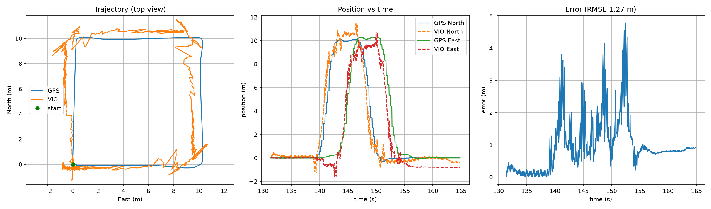

# VIO SITL Drone using ArduPilot + Gazebo (no ROS)

A visual-inertial odometry (VIO) pipeline for a simulated Iris quadcopter. It uses
ArduPilot SITL, Gazebo Harmonic, a down-facing camera, and Python only (no ROS).

## What it does
1. Runs ArduPilot SITL with Gazebo (JSON interface).
2. Takes off, flies a 10 m square and lands, using MAVLink (`takeoff_land.py`).
3. Subscribes to the Iris camera with gz-transport and estimates position with a
   lightweight visual-inertial odometry (`vio.py`).
4. Compares GPS position with VIO position and plots the error (`plot.py`).

## Method (short)
- KLT optical flow tracks features between frames.
- Attitude (from the autopilot's IMU-based EKF) rotates each pixel ray into the NED frame.
- Height gives metric scale: rays are intersected with a flat ground plane.
- The median of per-feature ground displacements is integrated into a position.

This is a loosely coupled VIO with a flat-ground assumption, not a full
tightly coupled system (such as OpenVINS or VINS).

## Results
Flight: 10 m square at 10 m altitude.

| Metric | Value |
|---|---|
| RMSE | 1.27 m |
| Max error | 4.79 m |
| GPS path length | 40.5 m |



## Requirements
- Ubuntu 24.04, Gazebo Harmonic, ArduPilot (ArduCopter SITL)
- `ardupilot_gazebo` plugin
- Python: `pymavlink`, `numpy`, `opencv-python`, `matplotlib`, and the apt packages
  `python3-gz-transport13`, `python3-gz-msgs10`

## Setup
```bash
cp -r models/iris_vio ~/ardupilot_gazebo/models/
cp worlds/iris_vio_world.sdf ~/ardupilot_gazebo/worlds/
```

## Run (4 terminals, Python venv active)
```bash
# 1  Gazebo
gz sim -v4 -r iris_vio_world.sdf
# 2  SITL (wait ~1 min for GPS/EKF)
cd ~/ardupilot
sim_vehicle.py -v ArduCopter -f gazebo-iris --model JSON --console \
  --out=udp:127.0.0.1:14560 --out=udp:127.0.0.1:14561
# 3  VIO
python3 vio.py
# 4  Flight (run once per vio.py session)
python3 takeoff_land.py
# after landing: Ctrl+C in terminal 3, then
python3 plot.py
```

## Files
| File | Purpose |
|---|---|
| `takeoff_land.py` | Arm, take off, fly a square, land (pymavlink) |
| `vio.py` | Camera subscription and VIO, writes `vio_log.csv` |
| `plot.py` | GPS vs VIO plot and error metrics |
| `models/iris_vio/` | Iris with a fixed down-facing camera |
| `worlds/iris_vio_world.sdf` | World with textured ground tiles |
| `results/` | Logs and plots |

## Limitations and future work
- Flat-ground assumption; error grows with distance (drift).
- Attitude/height are matched to images by latest value, not interpolated by timestamp.
- Future: timestamp interpolation, IMU preintegration, EKF fusion, feeding the
  estimate to ArduPilot as `VISION_POSITION_ESTIMATE`.

## Demo videos
- Takeoff and landing: <[link](https://drive.google.com/drive/folders/1hYlhr-4Xe9rqmqvKwDggKR8okjN65LIU?usp=sharing)>
- GPS vs VIO plot: <[link](https://drive.google.com/drive/folders/1hYlhr-4Xe9rqmqvKwDggKR8okjN65LIU?usp=sharing)>
